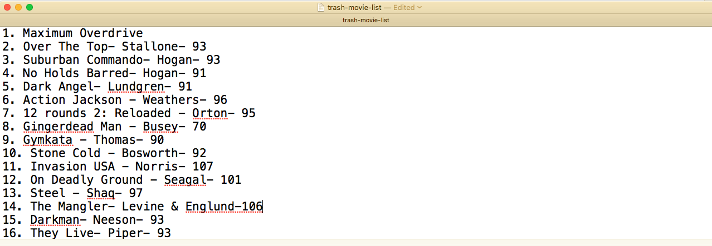
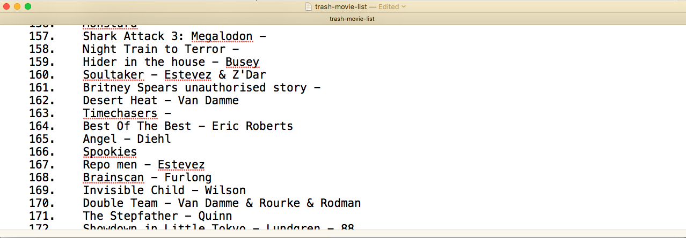
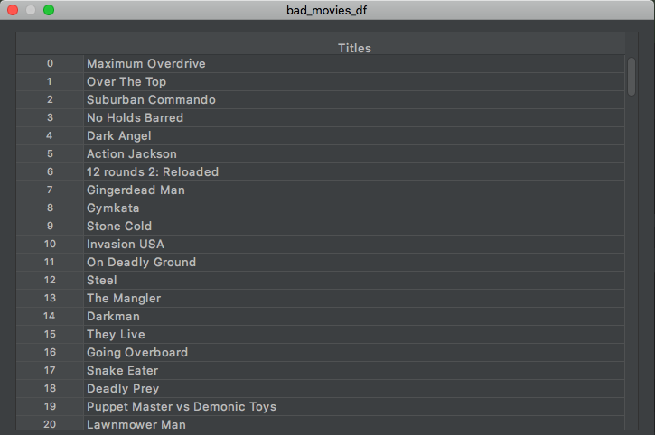

## Data Wrangling
An integral part of the Data Science process is _data wrangling_. This essentially means modifying data in such a way that makes it '_programming language friendly_'. What I mean by this is transforming the data, so it works well with the libraries that we want to use to manipulate, visualise and model the data with. In more specific terms, data wrangling  is the:

> process of transforming and mapping of data from one 'raw' data form into another format with the intent of making it more
> appropriate and valuable for a variety of downstream purporses such as analytics.

For my questionable movies project, me and my friends compiled a large list of all the movies we had watched over the years.
These lists were stored and updated in a note in the Notes app on the iPhone. I copied the contents to a txt file with the raw format seen below.




Immediately after looking at the structure of this file a few things that I needed to do became obvious:

1. I did not need the **numbers** of each film.
2. I did not need the **run time**.
3. I did not need the **actors**.

I needed to format this file to have only the film title on each line of this file. I could find all the other relevant metadata
for each film later by merging it with an existing dataframe with IMDB data or later, I discovered, using the wonderful [IMDbPY](https://imdbpy.github.io/) 
package. \
The data wrangling task at hand required pattern matching string manipulation. Enter **Regular Expressions**.

## Regular Expressions
A **regular expression** or better known as **regex** is:

> a sequence of characters that define a search pattern. 

It is like a language that we can use to search for really specific and complicated patterns in strings that contain any characters. This is indispensable in working with data structures that have elements that are described by characters. Think phone numbers, emails, contact information, addresses and so on. 
In our case we want to write a regular expression that leaves **only the titles** on each line. 

I want to first construct the skeleton of the pattern in words to create a guide for the search pattern. Looking at the text file I want to remove all characters after and including the dash. This will remove all the run times and actors. \
Next is to remove all leading digits and periods. Finally, at the end of the file the movies are recorded with some pretty rogue whitespaces, which need to be dealt with, as problems with libraries such as **pandas** pop up when there are erraneous whitespaces. 



The next step is to actually write the search pattern. There are numerous examples online for writing the syntax for regular expressions. They can be quite complicated. It is out of the scope of this article to cover all the syntax. I will however do
my best to explain my search pattern step by step. 

## The Search Pattern
```python
\-.*|^\d*.
``` 

The first character, known as a **metacharacter**, are characters that serve special functions. The dash needs to be escaped by the backslash **`(\)`** to match the dash **`(-)`** character, otherwise regex will interpret the dash as signifying a range of characters.
The period **`(.)`** metacharacter is a **wildcard** character. A wildcard is a placeholder represented by a single character which can be interpreted as a number of literal characters. This will match any character but the newline character **`(\n)`**. The next character is also a wildcard **`(*)`** and will match the character to its left zero or more times. This first search pattern will therefore match everything including and after the dashes and solves the first part of the pattern.
<br>

The **`(|)`** character is a logical operator that signifies **either or**. This will match the expression to its left **or** the expression to its right. The **`(^)`** tells regex to start the search at the start of the string or line, whilst the metacharacter **`(/d)`** will match any digits, followed by the wildcard  **`(*)`** for zero or more occurrences. Finally, the  **`(.)`** will match any single character after all the digits, in our case the period. 

That's it! We have the regular expression to format our text file. Fortunately, Python has a useful module [re](https://docs.python.org/3/library/re.html#module-re) to wrangle our text file with regex. 

## Re

Now to the juicy part. The code. First we import re and read in our file with the open context manager, write a list comprehension that strips the leading and trailing whitespaces for each line in the text file and save it to list object.

```python
import re

with open("trash-movie-list.txt", ) as file:
    # read txt file, convert to list
    lines = [x.strip() for x in file.readlines()]
```
We save the regex search pattern as a string and create another variable to replace matched patterns with an empty string. We use the sub method from the re module to replace all matched sequences with an empty string. We wrap this in another list comprehension and strip the lines again.

```python
# replace all numberings and everything in front the dashes
    pattern = '\-.*|^\d*.'
    replace = ""

    # store cleaned titles as specified by regex in a new list
    trash_list = [re.sub(pattern, replace, x).strip() for x in lines]
```

That's it! We can save the results to a Pandas DataFrame and check it out to see the processed movie titles.

```python
# store list in dataframe
bad_movies_df = pd.DataFrame(trash_list, columns=['Titles'])

test_df = bad_movies_df.head(10)

print(test_df)
```



## Wrapping Up
As you can see a lot of work goes into getting our data ready to use in for future use. Data doesn't always come in a 
useful or helpful format. Being able to spot and have the tools to wrangle data is thus essential for any aspiring data scientist 
like myself! I hope you found this article interesting and helpful. 