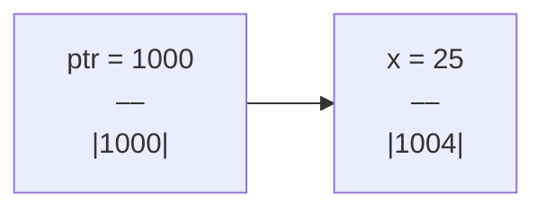

---
layout:	post
title:	"Pointers in C++"
description: What is all this pointer business
date:	2022-11-21
featured_image: '/images/posts/pointer-lichenstein.jpeg'
tags: data-structures algorithms breadth-first-search art copenhagen contemporary
author: Kostya Farber
---

# Pointers
## What are they?
Pointers are an essential part of the `c/c++` language. They are a powerful, mysterious and arcane tool. Kind of. They are actually quite simple.

> A pointer is a variable the stores the address of  another variable.

That's it.

Say we have a variable `x` of type `int` with value `25` stored at memory location `1004`. Then a pointer to `x` would contain the value `1004`.



<figcaption align = "center"><b>Fig1. Diagram of pointer and variable relationship.</b></figcaption>
<br>

*Note that a pointer also has an address which again could have a pointer pointing to it*.

## Syntax
So how do we use pointers in `c++`. Well we declare them using the `*`. 

```c++
int *my_ptr = nullptr;
char *my_char_ptr = nullptr;
double *my_double_ptr = nullptr;
```

It's easier to read this from right to left as: *a pointer of type integer, called my_ptr*. 

> It is important to note that it is best practise to always intiliaze pointers. If we don't they can be pointing *anywhere* and if we were to use this pointer we could change something in a memory location that we don't want to

## Address
How do we even get the address of a variable, if say, we wanted to store that in a pointer? In `c++` we can use the `&`. This operator is known as the *address-of* operator.

```c++
int foo = 25 // (address 1004)
int *ptr = nullptr;

ptr = &foo; 

cout << ptr // --> 1004
```

## Dereferencing
The next logical thing to think about is whether we can access the *underlying value* the pointer is pointing to. Of course we can! We do this using the *dereference operator*. This can simply be read as ***the value pointed to by***.

Using the example from above:

```c++
int foo = 25; // (address 1004)
int *ptr = nullptr;

ptr = &foo; 

cout << *ptr // --> 25
```

*Note: do not get confused with using the `*` in different contexts. They do different things depending on where you use them. For example in declaring pointers vs dereferencing them.*

## Changing values using pointers
We can change the value the pointer is pointing too. This is quite simple.

```c++
double temp = 37.5;
double *temp_ptr = &temp;

cout << temp; // 37.5

*temp_ptr = 10.0;

cout << temp; // 10.0
```

Notice here that we first **dereference** the pointer, that is we say, grab the value pointed to by pointer and then assign `10.0` to that variable.

If we where to try do this *without* dereferencing, we would get an error as we would be attempting to assign a double to a pointer. This isn't allowed as pointers have to contain **addresses**.

## Pointers relationship to arrays
