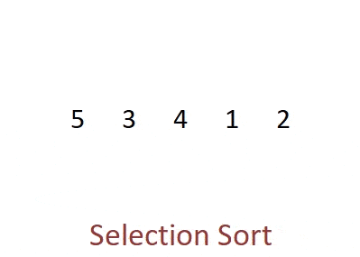

---
layout:	post
title:	"Selection Sort"
description: "A short post on one of the fundamental sorting algorithms" 
date:	2022-11-26
featured_image: '/images/posts/claw-machine.gif'
tags: data-structures algorithms breadth-first-search art copenhagen contemporary
author: Kostya Farber
---

## What is selection sort?
Selection sort is a sorting algorithm. It was one of the more inefficient sorting algorithms available. It takes in the worst case $O(n^2)$ in time complexity. 

## How does selection sort.. sort?
The idea behind selection sort is very simple. We iterate through our array and find the index of the smallest element. Once we pass through the array we swap the first value with current minimum value. 

I like to think of it as a claw machine grabbing the minumum element at every iteration and placing it in $n - i^{ith}$ position.


<figcaption align = "center"><b>Fig.1 - Selection sort in action</b></figcaption>
<br>
Now the first position is sorted. We do this for the rest of the $n - i$ elements (because the first element is now sorted). That's it.

It's easy to see why this is $O(n^2)$. For every element $i$ we have to iterate through the array $n - i$ times. Let's say we have an array of $n=5$. Then we have to iterate:

$$(n - 1) + (n - 2) + ... + 1$$

Which by arithmetic progression we know to be:

$$ \sum_{i=1}^{n - 1}i = \frac{(n - 1) + 1}{2}(n-1) = \frac{1}{2}n(n-1) = \frac{1}{2}(n^2 - n)$$

In Big O analysis we can drop the constants and keep the dominant power, which in this case is $n^2$, thus having a $O(n^2)$.

Below is an implementation in `c++`.

```c++
#include <iostream>
#include <vector>

using namespace std;
using namespace chrono;

void swap(int &a, int &b) {
    int temp = a;
    a = b;
    b = temp;
}

vector<int> selection_sort(vector<int> &nums) {
    
    for (int i = 0; i < nums.size(); i++) {
        int idx = i;
        for (int j = i + 1; j < nums.size(); j++) {
            if (nums[j] < nums[idx]) {
                idx = j;
            }
        }
        swap(nums[i], nums[idx]);       
    }

    return nums;
}

void print_vector(const vector<int> &vec) {
    for (auto num: vec) {
        cout << num << " ";
    }
    cout << endl;
}

int main() {
    vector<int> test = {4, 6, 2, 1, 7, 8, 10, -1, 3, 16};

    print_vector(test);
    selection_sort(test);
    print_vector(test);

    return 0;
}
```

