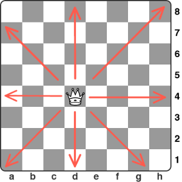

---
layout:	post
title:	"N-Queens"
description: Leetcode problem 
date:	2022-12-02
featured_image: '/images/posts/queen-playing-card.png'
tags: data-structures algorithms breadth-first-search art copenhagen contemporary
author: Kostya Farber
---

## Problem Description
Given an `nxn` board what are the different ways you can place queens on that board such that they cannot attack each other.

> *Queens can move any number of squares vertically, horizontally or diagnoally*



<figcaption align = "center"><b>Fig.1 - Different ways queen can move on a chess board</b></figcaption>
<br>
Here are some possible configurations for a `4 x 4` board.


<figcaption align = "center"><b>Fig.1 - Example of valid configurations</b></figcaption>

## Thought Process
If you were to look at the valid configuration of the board, you would notice that every queen is in it's own row and column. So as a start we know once we place a queen in a row, we cannot place another one in that row. We could try the next row and see if we can place a queen somewhere in this row. It might not lead to a valid solution, but it might. If this is sounding like a backtracking problem, then you are right.

## Backtracking
On a high level, a solution could look something like: **place queen in row, try the next row and see if any of the positions in that row are a valid placement for the queen**. What does it mean to be a valid placement? 

### Valid Placement
If we place queen in any position on the board `(i, j)` then we know column `j` is knocked out. For example below column `j=1` is unusable since a queen could attack there. Similarily that row is also knocked out since we just placed the queen there.

```python
[['x', 'Q', 'x']
,['-', 'x', '-']
,['-', 'x', '-']]
```

What about the diaganols? Well they are slightly more tricky.

### Diaganol
The way I like to play around with 2D matrices is to try see if any of the indexes at each position reveal any pattern. If we think about it there are two ***kinds*** of diaganols we are dealing with. 

* A positive diaganol which slope upwards (with letters representing the same diaganol):

```python
[['a', 'b', 'c']
,['b', 'c', 'd']
,['c', 'd', 'b']]
```

* And a negative diaganol:

```python
[['a', 'c', 'd']
,['b', 'a', 'c']
,['d', 'b', 'a']]
```

The trick here is, if we take the indexes at each position in the positive and negative diaganols and plot them, you would notice that at each move a constant calculation is being performed.

#### Positive diaganols
```python
[['0', '1', '2']
,['1', '2', '3']
,['2', '3', '4']]
```
#### Negative diaganols 
```python
[['0', '-1', '-2']
,['1', '0', '-1']
,['-2', '1', '0']]
```

Trivially for the positive diaganol it is `row + column`. For example the diaganol starting at `(1, 0)` moves to `(0, 1)` which both equal `1`. You can check this property for the rest of the positions.

Similarily, on the negative, each value is given by `row - column`. For example, at position `(0, 0)` we move to `(1, 1)` then finally `(2, 2)`, all of which equal zero.

### Valid Placement Revisited
So this means that we can check a position on the board is valid by making sure that any queens currently on the board can't attack it by checking:
* A valid row (which we don't have to keep track of because once we place a queen we simply move on to the next row)
* The knocked out columns
* The knocked out positive and negative diaganols

Looks like we have an algorithm to work with here.

## Algorithm
We can follow these steps:

1. If we reach the end of the board (i.e no more queens to place) add this configuration to our result
2. Otherwise, for each column in this row, check if we can place a queen there
3. If so place the queen and try out all positions in the next row
4. If we've tried all columns and we can't find a valid configuration, return and take the queen back and try any other positions in the previous step

To keep track of the positions that we cannot place a queen into, we can keep a set of already used columns, positive diaganols and negative diaganols.

## Implementation

```python
import sys
import numpy as np

class Solution:
    def __init__(self):

        self.valid_c = set()
        self.valid_p_diag = set()
        self.valid_n_diag = set()
        self.res = []

    def _add_to_sets(self, col, p_diag, n_diag):
        self.valid_c.add(col)
        self.valid_p_diag.add(p_diag)
        self.valid_n_diag.add(n_diag)

    def _remove_from_sets(self, col, p_diag, n_diag):
        self.valid_c.remove(col)
        self.valid_p_diag.remove(p_diag)
        self.valid_n_diag.remove(n_diag)

    def _set_check(self, col, p_diag, n_diag):
        if col not in self.valid_c and p_diag not in self.valid_p_diag and n_diag not in self.valid_n_diag:
            return True
        
        return False

    def _print_boards(self):
        for i, board in enumerate(self.res):
            print(f"Solution {i + 1} is: \n")
            print(np.array(board), end='\n\n')

    def solve_n_queens(self, N):
        board = [["-" for _ in range(N)] for _ in range(N)]
        def backtrack(r):
            if r == N:
                copy = [row[:] for row in board]
                self.res.append(copy)
                return
            
            for col in range(N):
                p_diag = r + col
                n_diag = r - col

                if self._set_check(col, p_diag, n_diag):
                    self._add_to_sets(col, p_diag, n_diag)
                    board[r][col] = 'Q'
                    
                    backtrack(r + 1)

                    # backtrack
                    board[r][col] = '-'
                    self._remove_from_sets(col, p_diag, n_diag)
        
        backtrack(0)
        self._print_boards()

if __name__ == "__main__":
    try:
        n = int(sys.argv[1])

    except IndexError as e:
        print("You didn't provide a command line argument \n")
        n = int(input("Please pick a number: "))

    s = Solution()
    s.solve_n_queens(n)
```
These are the possible solutions for a `4x4` board:

Solution 1 is: 

```python
[['-' 'Q' '-' '-']
 ['-' '-' '-' 'Q']
 ['Q' '-' '-' '-']
 ['-' '-' 'Q' '-']]
```

Solution 2 is: 

```python
[['-' '-' 'Q' '-']
 ['Q' '-' '-' '-']
 ['-' '-' '-' 'Q']
 ['-' 'Q' '-' '-']]
```

## Gotcha
Don't forget to copy each **individual row (list) or perform a deep copy** if you are keeping a results list. Copying a 2D array does not copy the objects in it. Otherwise you will keep seeing an empty board becuase everytime you backtrack you remove the solution from every board!

Thanks for reading and happy coding.