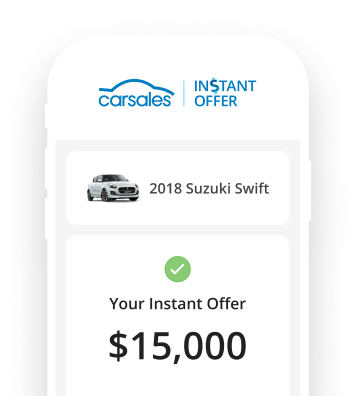

## Motivation

In mid-2022 I made the move to relocate to London. An inevitable part of moving overseas is getting rid of any belongings you don't need to take with you. One of these belongings was my *2013 Mazda 3 Sedan*. A fundamental question that needs to be answered is:

> How much is my car worth on the second hand market?


<figcaption align="center"><b>Fig.1 - My Mazda 3, one of the images I used to sell the car.</b></figcaption>
<br>

I've found myself an interesting problem that I needed to solve to help me get a fair price for my car. I decided to create an application that would give me a data-driven answer to my problem.

## How Did I Do It?


A popular site, [carsales.com.au](https://www.carsales.com.au/) allows users to sell their second-hand cars. This acts as a marketplace for buyers and sellers. I searched for cars that fit the description of my Mazda. From here I could grab all the prices of the cars on the market (on carsales.com.au) and base my price of this. I used [BeautifulSoup](https://beautiful-soup-4.readthedocs.io/en/latest/) to scrape the html of the page and find the sales prices. 

### Code
Using Google Chrome's inspect, I isolated the correct class, aptly named `title` in the `h1` tags. I used a class to implement my scraper called `CarSalesScraper`. It performs all the scraping tasks and data cleansing needed for ingestion into my database. You can find the source code in the GitHub link above.

### AWS


<figcaption align = "center"><b>Fig.2 - AWS Lambda, DynamoDB and Simple Notification Service Icons.</b></figcaption>
<br>

I employed Amazon Web Services (AWS) to manage my database solution, daily execution of the code and email notifications. 
- **AWS Lambda** managed the daily execution side.
- **AWS DynamoDB** was used to store the average, median and raw sales price
-  Finally **AWS Simple Notification Service (SNS)** was used to send email notifications when my DynamoDB was written to.

## Challenges
One challenge I ran into was using packages that aren't available in the off the shelf Lambda. To make matters slightly more difficult my solution locally is on a ***Mac OS X***. Lambda runs on ***Linux***. So I couldn't simply package my implementation of BeautifulSoup onto a lambda layer as it's coming from a Mac.

### Solution


<figcaption align = "center"><b>Fig.3 - Cloud9 Amazons Web Services' IDE and Linux Icons.</b></figcaption>
<br>

After some research online I found an easy solution within the AWS ecosystem. Cloud9. 

> AWS Cloud9 is a cloud-based integrated development environment (IDE) that lets you write, run, and debug your code with just a browser.

We can spin up this environment run on top of Linux and create a zip `deployment.zip` and use it to install packages into this zip.

```sh
pip3 install -t . your_packages
```

Adding this zip to Lambda as a layer allows the managed service to access our package and our script can execute.

## Outcome 

Using this solution I was able to get a gauge on the market. Every morning I got updates on the average, median and raw prices. I was able to adjust the prices accordingly day to day. Eventually I successfully sold my car for a good price. Being able to have data to inform my decision put me at ease and allowed me to set prices confidently. Using the cloud made creating this application a breeze and the joy from using technology to help others and myself is priceless!  

source: [https://github.com/kostyafarber/car-sales](https://github.com/kostyafarber/car-sales)