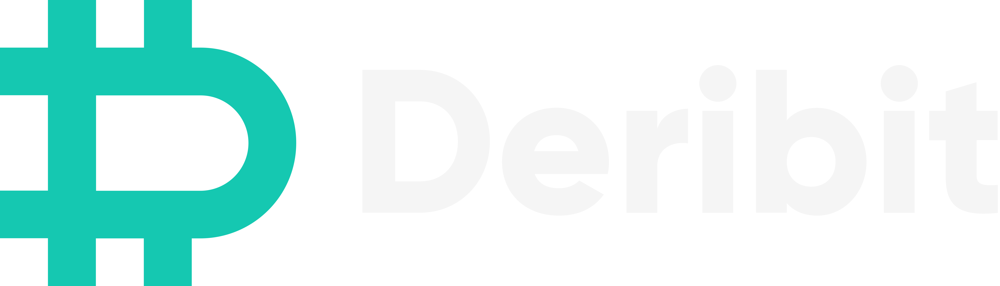
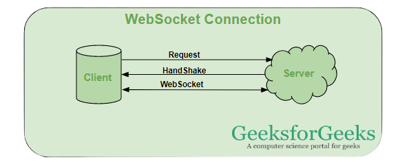
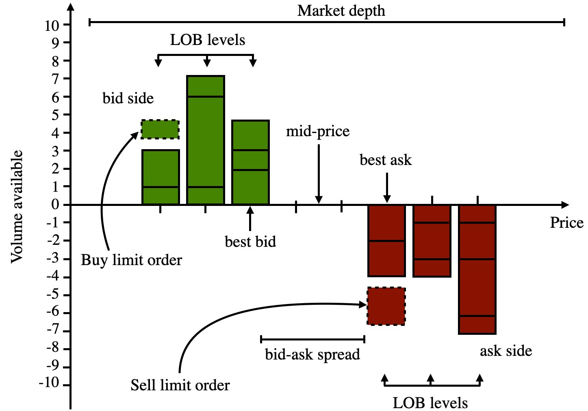
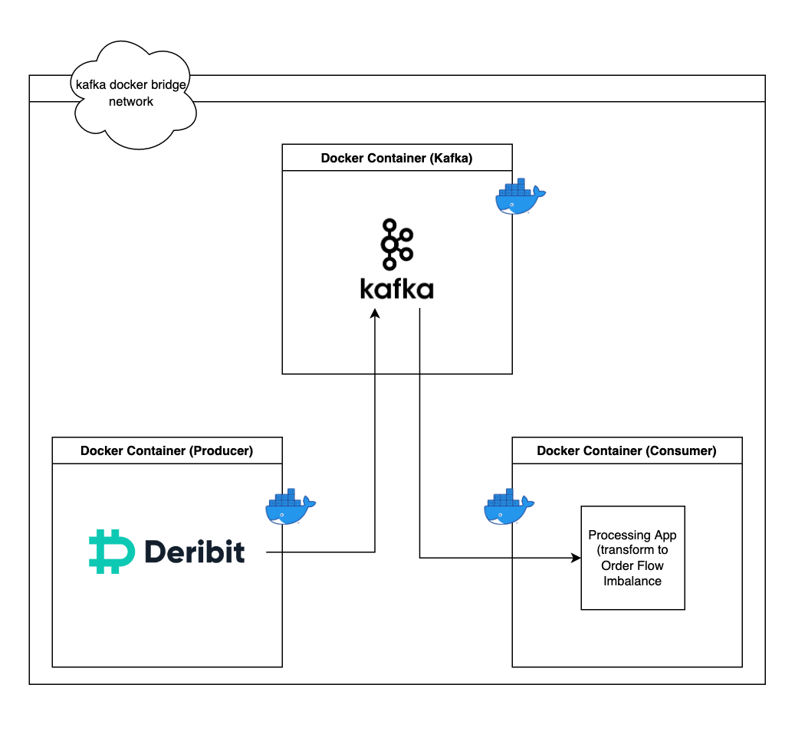
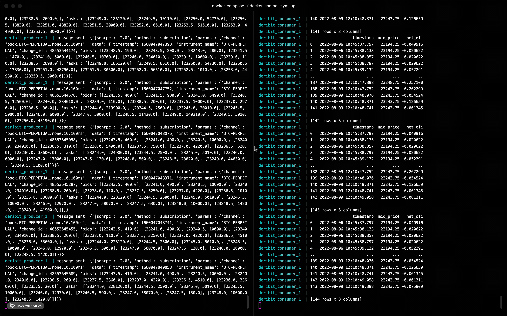

<div class=technologies>
Docker.Kafka.Deribit.Python.Pandas.
</div>

## Algorithmic Trading
I originally intended to create an algorithmic trading system based on limit order book (LOB) data. I wanted to trade cryptocurrency **perpetual** futures. 

> The Deribit Perpetual is a derivative product similar to a future, however, without an expiry date. The perpetual contract features funding payments. These payments have been introduced to keep the perpetual contract price as close as possible to the underlying crypto price - the Deribit BTC Index.

I also wanted to choose a platform that provides an API where I could access live LOB data. I chose [Deribit](https://www.deribit.com/) as they meet both my needs. 
<br>
<br>

<p align="center">
  
</p>
<figcaption align = "center"><b>Fig.1 - Deribit's Logo</b></figcaption>

## Python Websocket
Deribit provides three different interfaces to access the API:

- JSON-RPC over Websocket
- JSON-RPC over HTTP
- FIX (Financial Information eXchange)

<p align="center">
  
</p>
<figcaption align = "center"><b>Fig.2 - An Inital Websocket Connection.</b></figcaption>
<br>

I decided to use JSON-RPC over Websocket. JSON-RPC is a light-weight remote procedure call (RPC) protocol. The JSON-RPC specification defines the data structures that are used for the messages that are exchanged between client and server, as well as the rules around their processing. JSON-RPC uses JSON (RFC 4627) as data format. 

```python
{
    "jsonrpc": "2.0",
    "id": 8066,
    "method": "public/ticker",
    "params": {
        "instrument": "BTC-24AUG18-6500-P"
    }
}
```
<figcaption align = "center"><b>Fig.3 - An example of a request message</b></figcaption>
<br>

I used [this](https://github.com/ElliotP123/Deribit-API_Authentication-Examples/blob/master/JSON-RPC_Websockets/JSON-RPC_Websockets-AuthenticationExample.py) code as a base to create my websocket client in Python to access the live streaming data for the perpetual futures. It handles the authentication and subsequent subscription of the required data.

## Subscription Management
The subscribe method can be used to subscribe to one or more channels. In most cases the channel name is constructed from a couple of elements. This makes it possible to specify exactly which information is required, and/or the frequency or aggregation level. These elements are considered parameters for the subscription.

For example, when subscribing to the channel `book.BTC-27JUL18.10.20.100ms`, the element `BTC-27JUL18` specifies that the name of the instrument (see naming), 10 means that the results should be grouped to that precision, etc.

## Streaming Order Book Data
For my purporses I subscribe to the `book.{instrument_name}.{group}.{depth}.{interval}`, which notifies the subscriber about changes to the order book for a certain instrument.

```python
{
  "params" : {
    "data" : {
      "timestamp" : 1554375447971,
      "instrument_name" : "ETH-PERPETUAL",
      "change_id" : 109615,
      "bids" : [
        [
          160,
          40
        ]
      ],
      "asks" : [
        [
          161,
          20
        ]
      ]
    },
    "channel" : "book.ETH-PERPETUAL.100.1.100ms"
  },
  "method" : "subscription",
  "jsonrpc" : "2.0"
}
```

<figcaption align = "center"><b>Fig.4 - An example notification for Ethereum (ETH).</b></figcaption>

## Limit Order Book
The objective was to obtain an indicator that could point to the state of the market at a certain point in time. An **order book** is the list of orders that a trading venue uses to record the interest of buyers and sellers in a particular financial instrument. 

<p align="center">
  
</p>
<figcaption align = "center"><b>Fig.5 - Limit Order Book Diagram</b></figcaption>
<br>

## Order Book Imbalance
The Order Book Imbalance is the difference between the best bid and best ask quantity quotes divided by its sum. Such that,

<br>
\\[ Imb_{t} = \frac{V_{t}^b - V_{t}^a}{V_{t}^b + V_{t}^a} \\]
<br>

The Order Book Imbalance measures whether the limit order book is buy or sell heavy. In fact, it is a good predictor of price direction.


## Designing the Architecture
Having all the groundwork laid in place I went about deciding on how I wanted to design this system. To make things simpler and get my hands dirty with the current trend of microservices, I wanted to use Docker and Kafka to build a simple and scalable ETL pipeline.


## Docker
Docker is a valuable tool for developers to ship and deploy their apps in an easy and accessible way. We can create *containers* that are self-contained environments that house our applications. Taking this a step further, we can decouple our system and build a microservices architecture by having our services in their own docker containers. I will use Docker to containerize a few services used for the data pipeline built using Kafka.
## Kafka

Apache Kafka is an open-source distributed event streaming platform used by thousands of companies for high-performance data pipelines, streaming analytics, data integration, and mission-critical applications. It uses a publisher and subscriber architecture, both of which are decoupled from the core functionality of Kafka. Apache Kafka has an API in Python called `kafka-python`. Using `kakfa-python` I am able to build the data pipeline using Python.

## Data Pipeline
The image below demonstrates the data pipeline utilising Docker and Kafka. We have seperate containers containing each microservice and Kafka itself. The Deribit producer container connects to the Derbit API and streams JSON records and publishes them to Kafka in a channel called *prices*. Seperately, the consumer connects to the *prices* topic and transforms the raw JSON into order flow imbalance and mid-price variables.

<br>
<p align="center">
  
</p>
<figcaption align = "center"><b>Fig.6 - Pipeline Architecture</b></figcaption>
<br>

## Microservices
Each service is unaware of the other but communicate through docker networking. By using Docker and Kafka we are able to create a scalable and fault tolerant architecture were each service is decoupled from one another. This is at the heart of modern day software engineering and enables large distributed systems to work efficiently.



<figcaption align = "center"><b>Fig.7 - The streaming data running with producer on the left and consumer on right.</b></figcaption>

## Wrapping Up
The purporse of this project was to get my hands dirty with real-time streaming data and containizeration technologies. I was able to write code that consumed an API delivering JSON over websocket. I designed a small distributed (capable) data pipeline using Kafka and containerized my services to adhere to microservice principles. I was able to transform raw data to obtain useful Market Microstructure variables such as order flow imbalance and the mid-price. Make sure to check out my GitHub for the source code and how to run it yourself!


