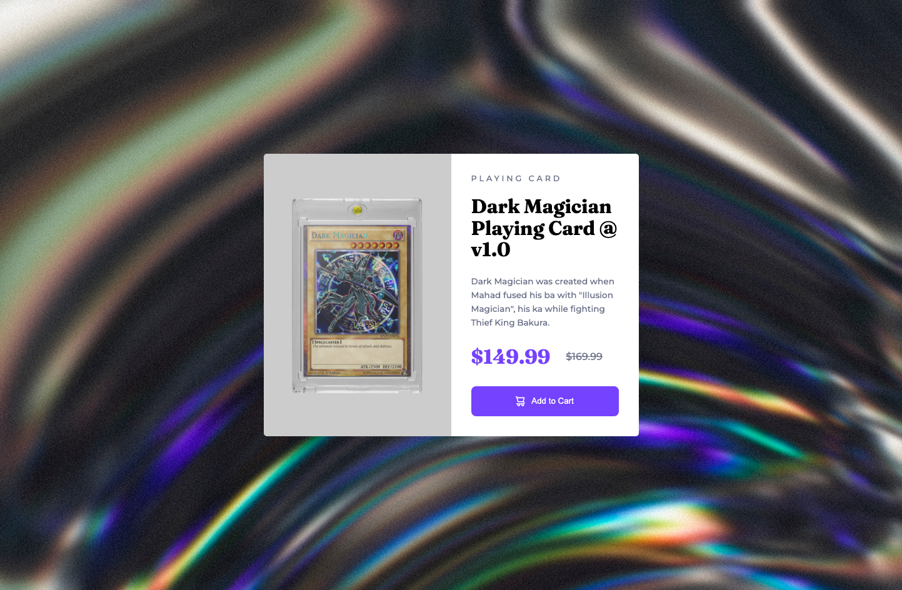

  

    

      <a href="https://rococo-hamster-1bb83d.netlify.app/">
        <picture>
          <source
            srcset="../images/gallery/nft-screenshot-sm.png"
            media="(max-width: 600px)"
          />
          
        </picture>
      </a>
    

    

      <a href="https://fastidious-wisp-afb1f4.netlify.app/">
        <picture>
          <source
            srcset="../images/gallery/stats-preview-sm.png"
            media="(max-width: 600px)"
          />
          
        </picture>
      </a>
    

    

      <a href="https://lighthearted-jelly-3b8d46.netlify.app/">
        <picture>
          <source
            srcset="../images/gallery/advice-generator-sm.png"
            media="(max-width: 600px)"
          />
          
        </picture>
      </a>
    

    

      <a href="https://elaborate-twilight-8e997d.netlify.app/">
        <picture>
          <source
            srcset="../images/gallery/product-preview-sm.png"
            media="(max-width: 600px)"
          />
          
        </picture>
      </a>
    

  

  <a
    class="carousel-control-prev"
    href="#carouselExampleControls"
    role="button"
    data-slide="prev"
  >
    
    Previous
  </a>
  <a
    class="carousel-control-next"
    href="#carouselExampleControls"
    role="button"
    data-slide="next"
  >
    
    Next
  </a>

