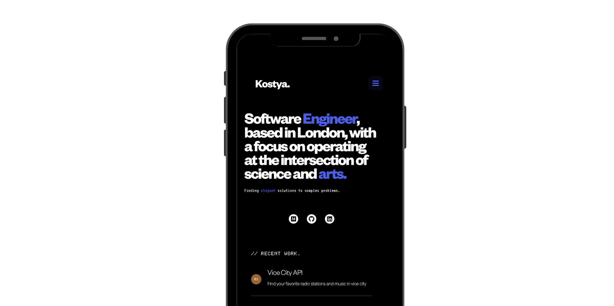
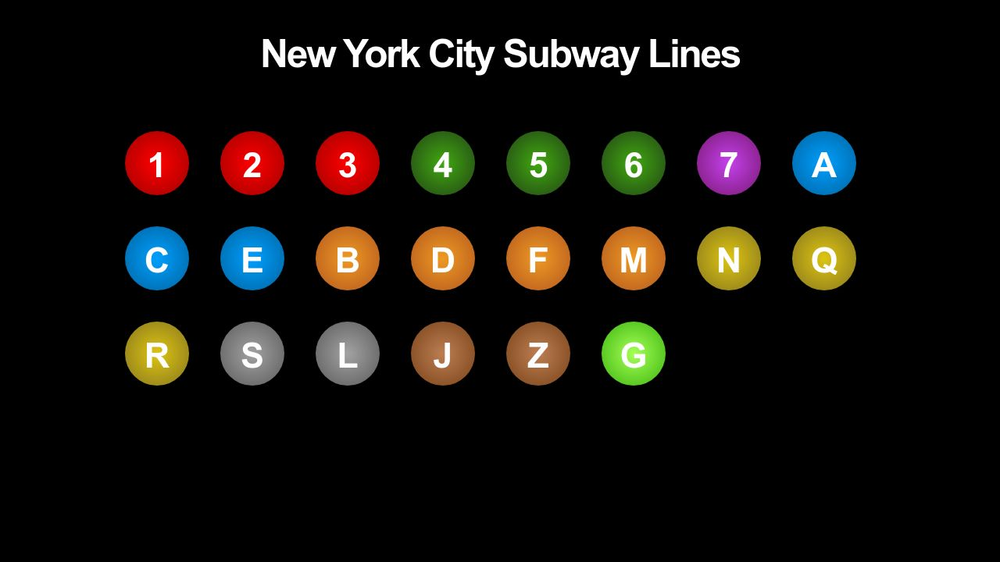
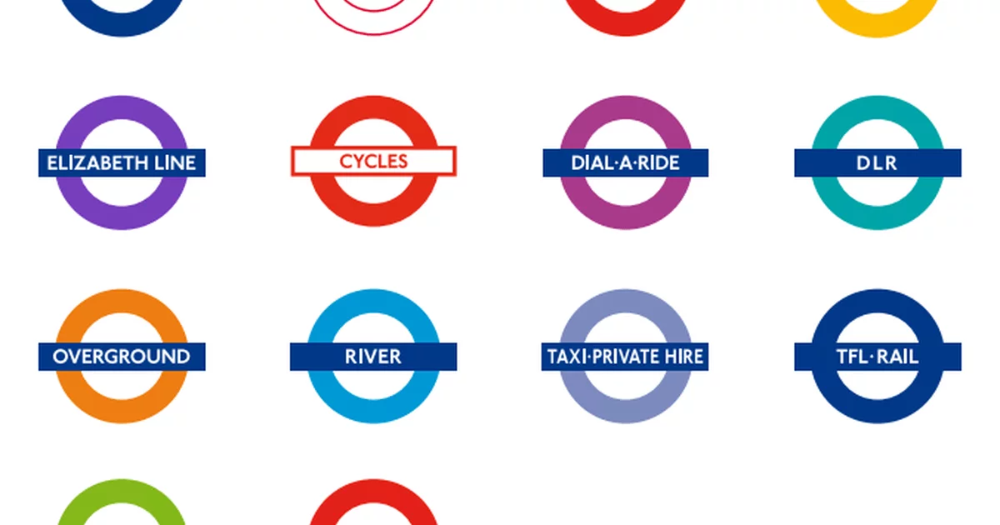
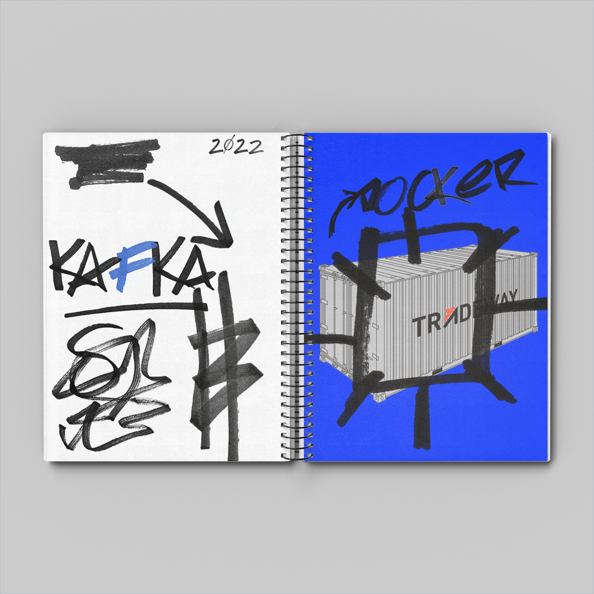

I decided to build a website to document my work as well as having a place were I can share my writing about topics I find interesting.

## Plumbing
I used [GitHub pages](https://pages.github.com/) to host the website and a Jekyll [theme](https://jekyllthemes.io/theme/made-portfolio-jekyll-theme) as a base.

## Typography
I love typography and spent a lot of time choosing the right fonts that express my design inclinations.

    

        <h1 class="font__grotesk">Founders Grotesk</h1>
    

    

        <h2 class="chars__grotesk" style="color: #ee352e;">abcdefghijklmnopqrstuvwxyz</h2>
        <h2 class="chars__grotesk">ABCDEFGHIJKLMNOPQRSTUVWXYZ</h2>
        <h2 class="chars__grotesk" style="color: #0039a6;">1234567890</h2>
    

    

        

            Founders Grotesk is a beautiful font from the folks at <a href="https://klim.co.nz/">Klim Foundry</a>. 
        

        

            The type is used throughout the site in document headings and as the logo for the footer and header (my name). It's definitely money well spent and looks gorgeous on the web on both mobile and laptop. 
        

        

            A large bold headline really brings out this type and is how I have used it throughout this site.
        

        

            More information on the design can be found <a href="https://klim.co.nz/blog/founders-grotesk-design-information/">here</a> if you are interested.
        

    

    

        <h1 class="font__mono">Berkeley Mono</h1>
    

    

        <h2 class="chars__mono">
        WORLD LEADING PRODUCT INNOVATION Makita® Corporation was founded in 1915 as an electric motor sales and repair company. Today, as a global brand in over 40 countries, Makita
        </h2>
    

    

        

            Berkeley Mono is one of my favorite releases this year. <a href="https://berkeleygraphics.com/">Berkeley Graphics</a> produced the type and their philosophy — Engineering graphics for professionals — really shines. I love everything about Berkeley Graphics, especially their <a href="https://twitter.com/berkeleygfx">Twitter</a>.
        

        

            The title of blog items, projects and the grid on the blog page use Berkeley Mono. It makes for a clean, readable type for content that is usually programming related. Having titles such as: 
            <h2 class="mono__example">TIL: bitwise ǀ and & on open flags in UNIX</h2>
        

        

            lend themselves to a crisp display using Berkeley Mono. 
        

        

            I use the type in my IDE and the all code blocks here. It looks clean af.
        

    

    

        
    

    

        <h1 class="font__london">London Underground</h1>
    

    

        

            

                
4

                
Bank

                
2 min

            

        

        

            

                
3

                
Clapham Common

                
3 min

            

        

        

            

                
1

                
Victora

                
10 min

            

        

    

    

        

            I moved to London in 2022. I catch the tube a lot. Someone dedicated a <a href="https://github.com/petykowski/London-Underground-Dot-Matrix-Typeface">whole project</a> which I found on <a href="https://news.ycombinator.com/item?id=36367667">HN</a> emulating what we see on the LED screen when waiting the short time for the tube to arrive. It's awesome.
        

        

            This is a homage to a new home for me and ends up in a couple of locations on the site. I use it for the dates of my posts and projects as well as the previous and next post text at the end of a blog post.
            <h2 style="font-family: London Underground; font-size: 1rem; color: #ecc12e;">13 DECEMBER 2021 </h2> 
            <h2 style="font-family: London Underground; font-size: 1rem; color: #ecc12e;">24 JULY 2023 </h2> 
        

    

    

        <h1 class="font__mono_tronica">Tronica Mono</h1>
    

    

        

            
grep(1)

            
NAME

            
tgrep, egrep, fgrep, rgrep, bzgrep, bzegrep, bzfgrep, zgrep, zegrep, zfgrep – file pattern searched

        

    

    

        

            Tronica Mono is an awesome pixelated terminal like typeface. I love anything pixelated. Tronica makes it's way around the site in a few areas. In the year part of the date in my footer, the numbers that order my projects, small heading on the home page and lastly in the About Me page.
        

    

## Colours
Most the colours chosen are inspired by various metropolitan subway stations. For instance the New York Subway.

  

Of course I have ran out of colours to use from the New York Subway. The tube to the rescue.

  

Eventually I'll have to start using the colours of Skittles or M&Ms.

## Images
I always try to create my own meaningful images that relate to what I am writing about.

For instance this is a screen grab from a short-lived game based on an awful movie (Toxic Avenger) that is popular with the B-movie crowd.

I used a variation of this in my page about my bad movie project. I made it in Adobe Photoshop using a Nintendo Game Boy Advance mockup.

Another example, for my Bitcoin pipeline project. This features a container (docker) mockup in a notebook, with some awesome marker assets (kafka) I found on Behance. This was also made on Photoshop. I enjoy the process of creating unique graphics to make my posts stand out.

## Inspiration
I find inspiration from unlikely places. Just observing things that I see when I walk around or just getting a general *feel* for what I want to achieve visually works too.

But I couldn't do without these awesome resources:
* [Pinterest](https://www.pinterest.co.uk/)
* [Behance](https://www.behance.net/)
* [Dribble](https://dribbble.com/shots)
* [awwwards](https://www.awwwards.com/)

I think a love of pop culture and culture in general most definitely informs my style and general inclinations towards certain visuals and styles.